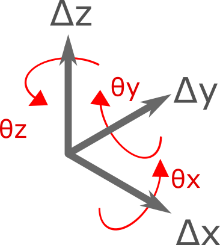

.. _Displacement:

Displacement
============

``Displacement`` object represents a general displacement in 3D (6 DoF, 3 straight displacement and 3 rotational).

Dx
---
``Dx`` represents the X component of displacement (Δx)

Dy
---
``Dy`` represents the Y component of displacement (Δy)

Dz
---
``Dz`` represents the Z component of displacement (Δz)

RX
---
``Rx`` represents the X component of rotation (θx)

Ry
---
``Ry`` represents the Y component of rotation (θy)

Rz
---
``Rz`` represents the Z component of rotation (θz)

Note that unit of rotations are Radians.