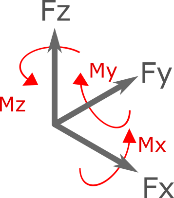

.. _Force:

Force
=====
``Force`` object represents a general concentrated force in 3D (3 force component and 3 moment components).

Fx
---
``Fx`` represents the X component of force

Fy
---
``Fy`` represents the Y component of force

Fz
---
``Fz`` represents the Z component of force

Mx
---
``Mx`` represents the X component of moment

My
---
``My`` represents the Y component of moment

Mz
---
``Mz`` represents the Z component of moment

.. figure:: images/force2.png
   :align: center
   
   
Examples
---

    var force1 = new Force();
	force1.Fx = 10;//x component of force equal to 10 [N]
	force1.Mz = 15;//z component of moment equal to 15 [N.m]
	
	
	var force2 = new Force(10,0,0,15,0,0);//using constructor, parameters are fx,fy,fz,mx,my,mz
	//force2 is equal to force1