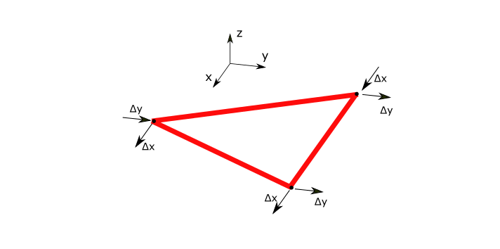
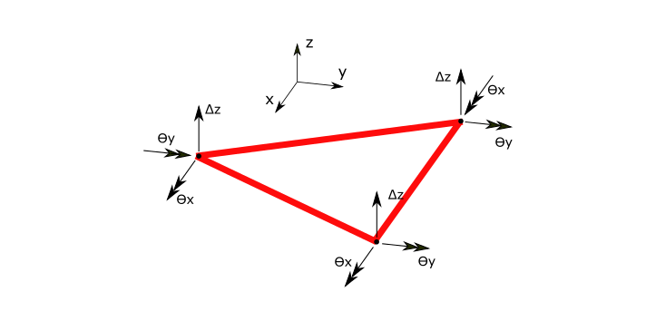
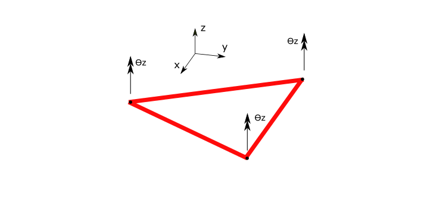
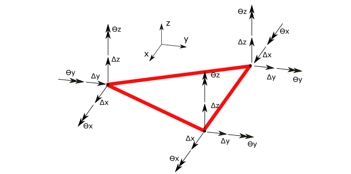

.. _TriangleElement-Behaviour:

Behaviours
----------
``TriangleElement.Behaviour`` property is an enum flag (enum flag  means an enum that can have several values at same time). It can be set to ThinShell, TODO etc. 
The possible behaviours for the TriangleElement is:

- ``TriangleElementBehaviour.Membrane`` : Membrane behaviour for in-plane displacement. DoFs are shown in below image:

   
   DoFs of ``TriangleElementBehaviour.PlateBending``

The mathematic formulation of this behaviour is based on standard CST (Constant Stress/Strain Triangle) element.

- ``TriangleElementBehaviour.PlateBending`` : PlateBending behaviour for in-plane rotations and out of plane displacements. DoFs are shown in below image:

   
   DoFs of ``TriangleElementBehaviour.PlateBending``
- ``TriangleElementBehaviour.DrillingDof`` : behaviour for out of plane rotations. DoFs are shown in below image:

   
   DoFs of ``TriangleElementBehaviour.DrillingDof``
   
The mathematic formulation of this behaviour is based on DKT (Discrete Kirchhoff Triangle) element.

These behaviours can be combined , for example a Membrane member should only have a Membrane behaviour, but a thin shell member does have behaviour of platebending and a membrane behaviour (both at the same time).
 
This is an example which makes a TriangleElement with plate bending behaviour which in real acts as a plate bending member that only can carry normal loads and in plate bendings:

.. code-block:: cs
   
   var tri = new TriangleElement();
   tri.Behaviour = TriangleElementBehaviour.ThinPlate;

There is another utility static class named ``TriangleElementBehaviours`` which contains predefined combination behaviours for TriangleElement which is more user (developer) friendly than original enum flag.
This is example usage of ``TriangleElementBehaviours`` class:

.. code-block:: cs
   
   var tri = new TrignaleElement();
   tri.Behaviour = TriangleElementBehaviours.ThinShell;

Which is exactly equal to:

.. code-block:: cs
   
   var tri = new TrignaleElement();
   tri.Behaviour = TriangleElementBehaviour.ThinPlate | TriangleElementBehaviour.Membrane | TriangleElementBehaviour.DrillingDof;

So better to use ``TriangleElementBehaviours`` unless needed manually define combination of behaviours.

- ``TriangleElementBehaviours.ThinShell`` and ``TriangleElementBehaviours.ThickShell``: 

   DoFs of ``TriangleElementBehaviours.ThinShell`` and ``TriangleElementBehaviours.ThickShell``