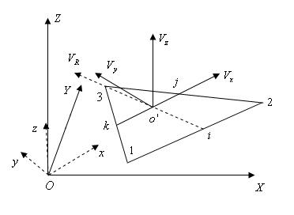

.. _TriangleElement-CoordinationSystems:

Coordination Systems
--------------------

Local Coordination System
^^^^^^^^^^^^^^^^^^^^^^^^^

Local coordination system for ``TriangleElement`` has tree axis that we name ``x``, ``y`` and ``z``. 

Relation of global and local system
^^^^^^^^^^^^^^^^^^^^^^^^^^^^^^^^^^^

local axis ``x`` is parallel with the point that connects ``node[0]`` to ``node[1]`` of element.

local axis ``z`` is normal to triangle's surface.

local axis ``y`` is normal to both ``x`` and ``z``.

   
   local coordination system of ``TriangleElement``

This formulation (and image above) taken from ``Development of Membrane, Plate and Flat Shell Elements in Java`` from author ``Kansara, Kaushalkumar`` available from ``https://vtechworks.lib.vt.edu/handle/10919/9936``