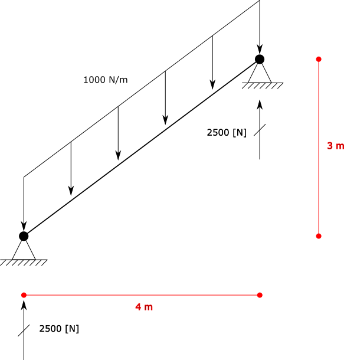
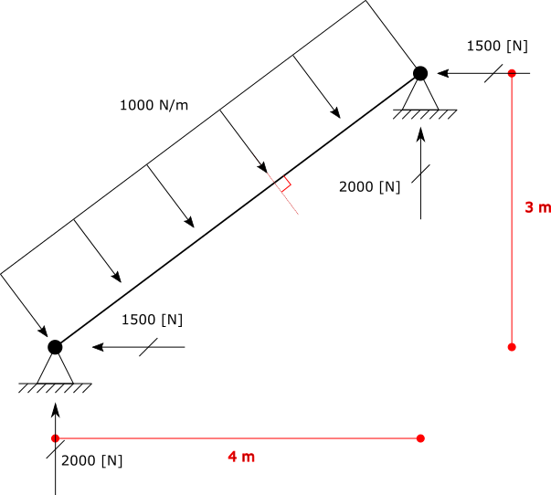
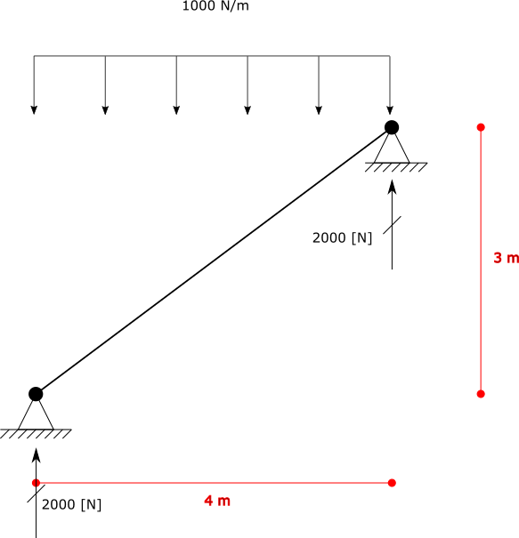

.. _element-load-coordination-system:

Element Load Coordination System Example
########################################

The `Loads.UniformLoad` have a property named ``CoordinationSystem`` of enum type ``BriefFiniteElementNet.CoordinationSystem`` which defines the coordination system of load (for more info see :ref:`UniformLoad-coordination-system`).

Using the combination of ``UniformLoad.CoordinationSystem`` and ``UniformLoad.Direction`` property, some specific distributed loads can be applied to elements.

Here are two examples:

Example 1
=========
Consider the inclined frame shown in fig below, under dead load.

   
There is an inclined element of length = ``5 [m]``, and an ``UniformLoad`` of magnitude ``1000 [N/m]``.

+ Magnitude of **1000 [N/m]**
+ Direction of **Z**
+ Coordination System of **Global**

**step 1:** create model, nodes and elements:

.. code-block:: cs

	var m1 = new Model();

	var el1 = new BarElement();

	el1.Nodes[0] = new Node(0, 0, 0) { Constraints = Constraints.MovementFixed & Constraints.FixedRX, Label = "n0" };
	el1.Nodes[1] = new Node(3, 0, 4) { Constraints = Constraints.MovementFixed, Label = "n1" };

	el1.Section = new Sections.UniformGeometric1DSection(SectionGenerator.GetISetion(0.24, 0.67, 0.01, 0.006));
	el1.Material = UniformIsotropicMaterial.CreateFromYoungPoisson(210e9, 0.3);

	var l1 = new Loads.UniformLoad();

	l1.Direction = Vector.K;
	l1.CoordinationSystem = CoordinationSystem.Global;
	l1.Magnitude = 1e3;

	el1.Loads.Add(l1);

	m1.Elements.Add(el1);
	m1.Nodes.Add(el1.Nodes);

	m1.Solve_MPC();

	Console.WriteLine("n0 reaction: {0}", m1.Nodes[0].GetSupportReaction());
	Console.WriteLine("n1 reaction: {0}", m1.Nodes[0].GetSupportReaction()); 

	
result

n0 reaction: F: 0, 0, -2500, M: 0, 0, 0
n1 reaction: F: 0, 0, -2500, M: 0, 0, 0

Example 2
=========
Consider the inclined frame shown in fig below, under wind load.

   
There is an inclined element of length = ``5 [m]``, and an ``UniformLoad`` of magnitude ``1000 [N/m]``.

+ Magnitude of **1000 [N/m]**
+ Direction of **Z**
+ Coordination System of **Local**

.. code-block:: cs

	var m1 = new Model();

	var el1 = new BarElement();

	el1.Nodes[0] = new Node(0, 0, 0) { Constraints = Constraints.MovementFixed & Constraints.FixedRX, Label = "n0" };
	el1.Nodes[1] = new Node(3, 0, 4) { Constraints = Constraints.MovementFixed, Label = "n1" };

	el1.Section = new Sections.UniformGeometric1DSection(SectionGenerator.GetISetion(0.24, 0.67, 0.01, 0.006));
	el1.Material = UniformIsotropicMaterial.CreateFromYoungPoisson(210e9, 0.3);

	var l1 = new Loads.UniformLoad();

	l1.Direction = Vector.K;
	l1.CoordinationSystem = CoordinationSystem.Local;
	l1.Magnitude = 1e3;

	el1.Loads.Add(l1);

	m1.Elements.Add(el1);
	m1.Nodes.Add(el1.Nodes);

	m1.Solve_MPC();

	Console.WriteLine("n0 reaction: {0}", m1.Nodes[0].GetSupportReaction());
	Console.WriteLine("n1 reaction: {0}", m1.Nodes[0].GetSupportReaction()); 
 

result

n0 reaction: F: 2000, 0, -1500, M: 0, 0, 0

n1 reaction: F: 2000, 0, -1500, M: 0, 0, 0

Example 3
=========
Consider the inclined frame shown in fig below, under snow load.

+ Projected Magnitude of **1000 [N/m]**
+ Direction of **Z**
+ Coordination System of **Global**
   
There is an inclined element of length = ``5 [m]``, and an ``UniformLoad`` of magnitude ``1000 [N/m]`` which is projected.
There is a difference about this type of load with two other examples above. For applying such projected load, first we have to convert it to example 1. 
Based on `toturial in www.learnaboutstructures.com <http://www.learnaboutstructures.com/Determinate-Frame-Analysis>`_ this is the way to convert:

So in this example we do not need theta value itself, but we need `Cos(θ)` or more precise absolute value of it `|Cos(θ)|`. Due to elementary trigonometry relations `Cos(θ)=Sin(90°-θ)`. So instead of `|Cos(θ)|` we can calculate `|Sin(α)|` where `α = 90°-θ` and `α` equals to angle between load direction and element direction. For finding `|Sin(α)|` we can use length of cross product of two unit vectors of element direction and load direction. This coefficient is always a non negative value and less than or equal to `1.0`. If element is horizontal then `|Cos(θ)| = 1.0` if element is vertical then `|Cos(θ)| = 0.0`.

.. hint:: Note that actually two vectors have to angles between them, a bigger one and a smaller one, but absolute value of cosine of them both are same i.e `|Cos(θ)| = |Cos(180°-θ)|`

.. code-block:: cs

	var m1 = new Model()
	var el1 = new BarElement();

	el1.Nodes[0] = new Node(0, 0, 0) { Constraints = Constraints.MovementFixed & Constraints.FixedRX, Label = "n0" };
	el1.Nodes[1] = new Node(4, 0, 3) { Constraints = Constraints.MovementFixed, Label = "n1" };

	el1.Section = new Sections.UniformGeometric1DSection(SectionGenerator.GetISetion(0.24, 0.67, 0.01, 0.006));
	el1.Material = UniformIsotropicMaterial.CreateFromYoungPoisson(210e9, 0.3);

	var loadMagnitude = -1e3;
	var loadDirection = Vector.K;

	var l1 = new Loads.UniformLoad();

	var elementDir = el1.Nodes[1].Location - el1.Nodes[0].Location;//or n0 - n1, does not matter
	
	var absCosTeta = Vector.Cross(elementDir.GetUnit(), loadDirection.GetUnit()).Length;

	l1.Direction = loadDirection;
	l1.CoordinationSystem = CoordinationSystem.Global;
	l1.Magnitude = loadMagnitude * absCosTeta; //magnitude should multiple by reduction coefficient absCosTeta

	el1.Loads.Add(l1);

	m1.Elements.Add(el1);
	m1.Nodes.Add(el1.Nodes);

	m1.Solve_MPC();

	Console.WriteLine("n0 reaction: {0}", m1.Nodes[0].GetSupportReaction());
	Console.WriteLine("n1 reaction: {0}", m1.Nodes[0].GetSupportReaction());
 

result

n0 reaction: F: 0, 0, 2000, M: 0, 0, 0
n1 reaction: F: 0, 0, 2000, M: 0, 0, 0

whole source code exists in the `UniformLoadCoordSystem.cs` file.
