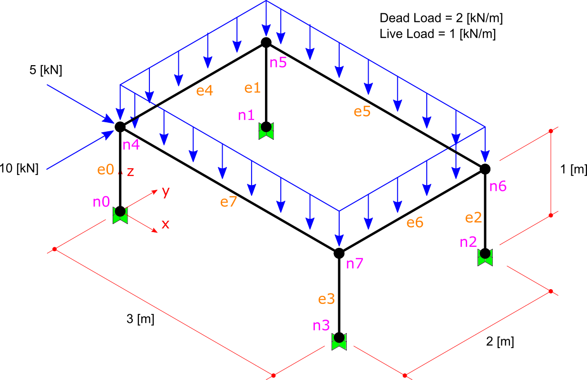

LoadCase and LoadCombination Example
#######################################

In Finite Element, there is a thing named Force or Load. Also there are 

There are two concepts named LoadCase and LoadCombination in this library and many other softwares.
A ```LoadCase``` defines the group of loads. For example, in structure below there is a "dead" load and a "live" load, and two "earthquake" loads, in X and Y direction on `n4` node:


   
   Model with 4 type of load
   
The LoadCase struct have a nature property (an enum type) and a title property (with string type). LoadNature can be:
``Default``, ``Dead``, ``Live``, ``Snow``, ``Wind``, ``Quake``, ``Crane`` and ``Other``.

So there can be 4 LoadCases for this example:
	- case 1: Nature = Dead, Title = "D1"
	- case 2: Nature = Live, Title = "L1"
	- case 3: Nature = Quake, Title = "Qx"
	- case 4: Nature = Quake, Title = "Qy"

We will do these steps before solving model:

- Step1: Create Model, prepair and add Elements and Nodes

- Step2: Assign Constraints to Nodes (fix the DoF s).

- Step3: Assign Load to Node.

Step1: Create Model, prepair and add Elements and Nodes
=======================================================
To make the model, elements and loads:

.. code-block:: cs
    
    //source code file: LoadCombExample.cs, project: BriefFiniteElementNet.CodeProjectExamples
    
    var model = new Model();
    
    model.Nodes.Add(new Node(0, 0, 0) { Label = "n0" });
    model.Nodes.Add(new Node(0, 2, 0) { Label = "n1" });
    model.Nodes.Add(new Node(4, 2, 0) { Label = "n2" });
    model.Nodes.Add(new Node(4, 0, 0) { Label = "n3" });
    
    model.Nodes.Add(new Node(0, 0, 1) { Label = "n4" });
    model.Nodes.Add(new Node(0, 2, 1) { Label = "n5" });
    model.Nodes.Add(new Node(4, 2, 1) { Label = "n6" });
    model.Nodes.Add(new Node(4, 0, 1) { Label = "n7" });
    
    
    var a = 0.1 * 0.1;//area, assume sections are 10cm*10cm rectangular
    var iy = 0.1 * 0.1 * 0.1 * 0.1 / 12.0;//Iy
    var iz = 0.1 * 0.1 * 0.1 * 0.1 / 12.0;//Iz
    var j = 0.1 * 0.1 * 0.1 * 0.1 / 12.0;//Polar
    var e = 20e9;//young modulus, 20 [GPa]
    var nu = 0.2;//poissons ratio
    
    var sec = new Sections.UniformParametric1DSection(a, iy, iz, j);
    var mat = Materials.UniformIsotropicMaterial.CreateFromYoungPoisson(e, nu);
    
    model.Elements.Add(new BarElement(model.Nodes["n0"], model.Nodes["n4"]) { Label = "e0", Section = sec, Material = mat});
    model.Elements.Add(new BarElement(model.Nodes["n1"], model.Nodes["n5"]) { Label = "e1", Section = sec, Material = mat });
    model.Elements.Add(new BarElement(model.Nodes["n2"], model.Nodes["n6"]) { Label = "e2", Section = sec, Material = mat });
    model.Elements.Add(new BarElement(model.Nodes["n3"], model.Nodes["n7"]) { Label = "e3", Section = sec, Material = mat });
    
    model.Elements.Add(new BarElement(model.Nodes["n4"], model.Nodes["n5"]) { Label = "e4", Section = sec, Material = mat });
    model.Elements.Add(new BarElement(model.Nodes["n5"], model.Nodes["n6"]) { Label = "e5", Section = sec, Material = mat });
    model.Elements.Add(new BarElement(model.Nodes["n6"], model.Nodes["n7"]) { Label = "e6", Section = sec, Material = mat });
    model.Elements.Add(new BarElement(model.Nodes["n7"], model.Nodes["n4"]) { Label = "e7", Section = sec, Material = mat });
    
    
Step2: Assign Constraints to Nodes (fix the DoF s)
==================================================

.. code-block:: cs

    model.Nodes["n0"].Constraints =
      model.Nodes["n1"].Constraints =
        model.Nodes["n2"].Constraints =
          model.Nodes["n3"].Constraints =
            Constraints.Fixed;

Step3: Assign load to nodes
===========================
This is main purpose of this example, the LoadCase and LoadCombination types. In framework every Load does have a property named ``LoadCase``. this LoadCase property will help us to distribute all Loads into groups. We want to do this because we should solve the model for each LoadCase separately. In this example we will create 4 load cases:

1. a load case with name ``d1`` and load type of dead for dead loads on top horizontal elements
 
2. a load case with name ``l1`` and load type of live for live loads on top horizontal elements
 
3. a load case with name ``qx`` and load type of quake for 5kN concentrated force applied to ``n4`` node

4. a load case with name ``qy`` and load type of quake for 10kN concentrated force applied to ``n4`` node

.. code-block:: cs

    var d_case = new LoadCase("d1", LoadType.Dead);
    var l_case = new LoadCase("l1", LoadType.Dead);
    var qx_case = new LoadCase("qx", LoadType.Quake);
    var qy_case = new LoadCase("qy", LoadType.Quake);

Then we should create two distributed loads for top beams:

.. code-block:: cs

    var d1 = new Loads.UniformLoad(d_case, -1 * Vector.K, 2e3, CoordinationSystem.Global);
    var l1 = new Loads.UniformLoad(l_case, -1 * Vector.K, 1e3, CoordinationSystem.Global);

    var qx_f = new Force(5000 * Vector.I, Vector.Zero);
    var qy_f = new Force(10000 * Vector.J, Vector.Zero);

note that we've set the load case of these two loads by passing ``d_case`` and ``l_case`` into constructor of ``Loads.UniformLoad`` class.

Next we will add ``d1`` and ``l1`` and two other nodal lo loads to all top elements. you should note that adding same load to more that one element is possible and will work like creating identical loads for each element.

.. code-block:: cs        

    model.Elements["e4"].Loads.Add(d1);
    model.Elements["e5"].Loads.Add(d1);
    model.Elements["e6"].Loads.Add(d1);
    model.Elements["e7"].Loads.Add(d1);
    
    model.Elements["e4"].Loads.Add(l1);
    model.Elements["e5"].Loads.Add(l1);
    model.Elements["e6"].Loads.Add(l1);
    model.Elements["e7"].Loads.Add(l1);

    model.Nodes["n4"].Loads.Add(new NodalLoad(qx_f, qx_case));
    model.Nodes["n4"].Loads.Add(new NodalLoad(qy_f, qy_case));
    
    model.Solve_MPC();//no different with Model.Solve()


as said before, all loads in BFE should inherit from NodalLoad or ElementLoad. Both of these loads have a property named LoadCase property of type ```LoadCase```. So every load in BFE will
have the LoadCase property. In other hand to get analysis result of model - like internal force on elements, or nodal displacements or support reactions - a parameter of type LoadCombination
should pass to the appropriated method.
For example to get internal force of bar element, this method should be called:

.. code-block:: cs
    
    BarElement.GetInternalForceAt(double x, LoadCombination combination);

Or to get support reaction of a node, this method should be used:

.. code-block:: cs
    
    Node.GetSupportReaction(LoadCombination combination);

A ```LoadCombination``` in a list of LoadCases with a multiplier for each one. Internally it does uses ```Dictionary<LoadCase,double>``` to keep the list. 
For example if want to find support reaction for node n3 with loadCombination D + 0.8 L:

.. code-block:: cs
    
    var combination1 = new LoadCombination();// for D + 0.8 L
    combination1[d_case] = 1.0;
    combination1[l_case] = 0.8;
    
    var n3Force = model.Nodes["N3"].GetSupportReaction(combination1);
    Console.WriteLine(n3Force);

or for finding internal force of ``e4`` element with combination ``D + 0.8 L`` at it's centre:

.. code-block:: cs
    
    var e4Force = (model.Elements["e4"] as BarElement).GetInternalForceAt(0, combination1);
    Console.WriteLine(e4Force);or ds