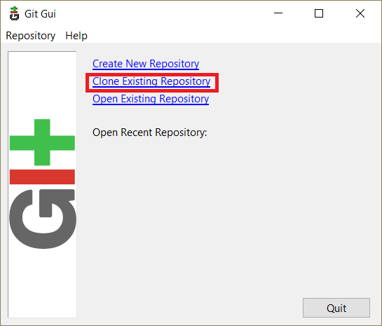
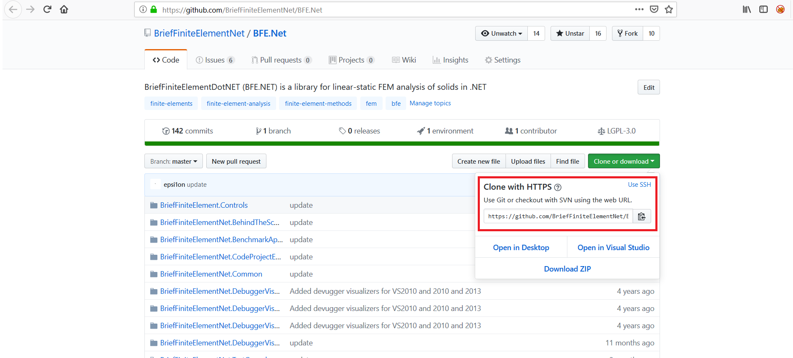
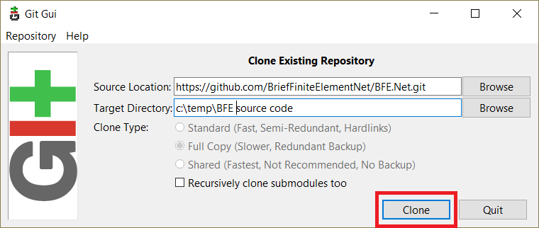
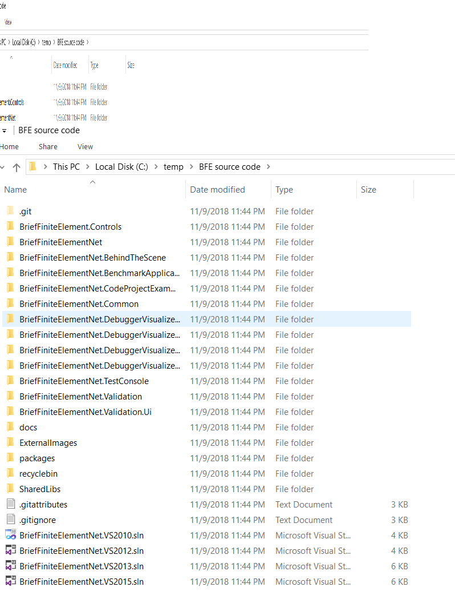
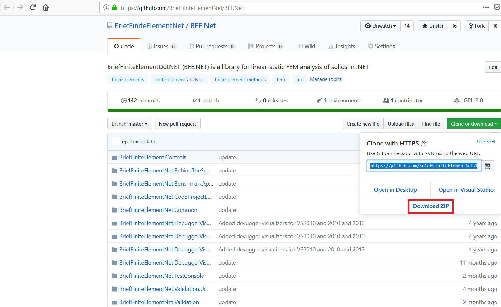

Download source code of BriefFiniteElement.NET library
======================================================

To download the source code there are three ways:

1. **Use git client**

2. **Direct download source code**

First way (using git client) is suggested as you have more control over source code and can keep source code sync with the latest source code on [github.com](https;//www.github.com).

Using Git Client to Download the Source Code
-------------------------------------------

We will use git for windows client over download the code. download and install client from [this link](https://gitforwindows.org/). After installation open the git-gui from either installed location or start menu:

.. figure:: ../images/startmenu-gitgui-win10.png
   :align: center

Then click the "Clone Existing Repository" on the main window:

   
in next window, on the source location insert the git location of source code, this address is available at project main page on github.gom:

by the way currently it is:
``https://github.com/BriefFiniteElementNet/BFE.Net.git``
paste it into source location.

in destination location type the folder you want the source code be downloaded into, note that this folder will be created with git client and should not exists, and finally click clone:

then wait until download finishes. Only note that use latest version of git client. after download finished, the git GUI will show up. close it and check the destination folder, there should be plenty of files there:

   
Direct download source code
---------------------------

From project main page in github.com click ``clone or download`` button then click ``download zip``:

