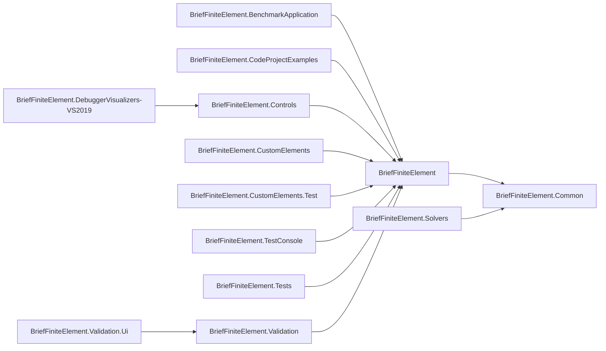

*BriefFiniteElement*: (Library) Main Library, contains built-in elements, built-in solvers (Cholesky and PCG), Loads etc.
*BriefFiniteElement.Tests*: (Library) Unit test for `BriefFiniteElement` library, specially for built-in elements
*BriefFiniteElement.BenchmarkApplication*: (Console executable) A consolve based application for measuring speed of BFE in several test cases
*BriefFiniteElement.CodeProjectExamples*: (Library) Contains examples from codeproject.com and readthedocs.com
*BriefFiniteElement.Common*: (Library) Contains very common interfaces and objects, specially `ISolver` interface which make it possible to defined external solvers in different assemblies
*BriefFiniteElement.Controls*: (Library) Contains several WPF controls for visualizing the `Model` with GUI
*BriefFiniteElement.CustomElements*: (Library) Contains external elements (at the time quadrilatural element) which are developed separately
*BriefFiniteElement.CustomElements.Test*: (Library) Contains unit test for `BriefFiniteElement.CustomElements` projects
*BriefFiniteElement.DebuggerVisualizers-VS2019*: (Library) Contains debugger visualizers which uses controls inside `BriefFiniteElement.Controls` to visualize the object while debugging with visual studio  
*BriefFiniteElement.Solvers*: (Library) Contains classes which implement `BriefFiniteElement.Common.ISolver` interface, to solve the model. Planned to add MKL and CUDA
*BriefFiniteElement.TestConsole*: (Console executable) Contains temporary codes, nothing special
*BriefFiniteElement.Validation*: (Library) Contains codes to validate the result of `Model` after solve, compare with wellknown softwares like opensees and frame3dd
*BriefFiniteElement.Validation.Ui*: (Console executable) Contains a simple console based UI for interacting with `BriefFiniteElement.Validation` projects.

project dependency diagram:

