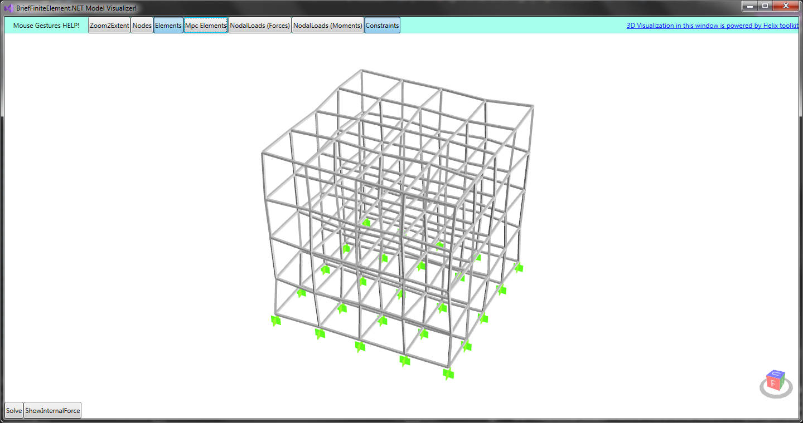
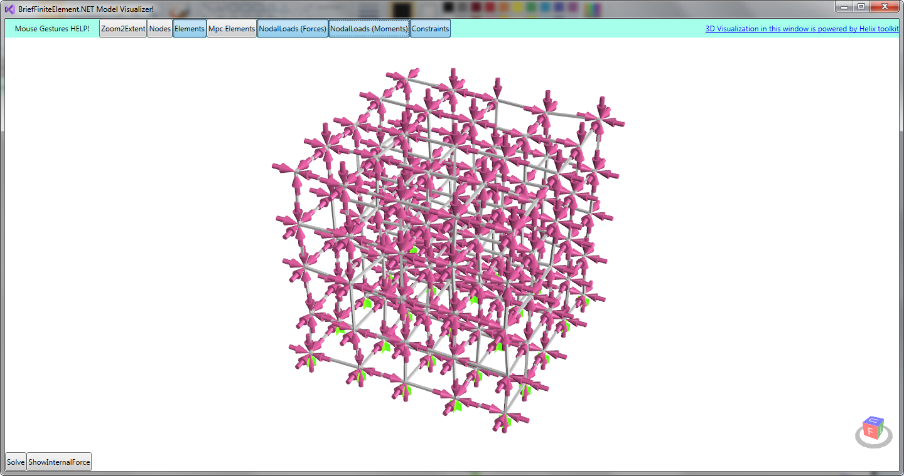

## Validation and Testing
In a FEM application, which can have a very complicated code dependency graph (for example a method is called several times from several places) it is a vital thing, beacause making mistake in placing a positive instead of a negative sign in a mathematics formula  
will almost always change the result to something other than expected.

This library is developed regarding "Code Reuse" so the code will be somehow complicated. There are several types of validation for FE models in this library:

- Unit Test (or integral test) (in project ``BriefFiniteElementNet.Tests``)
- Validating the result with OpenSees (the Open System for Earthquake Engineering Simulation) available at [opensees.berkeley.edu](http://opensees.berkeley.edu/)
- Validating the result with Frame3dd application available at [frame3dd.sourceforge.net](http://frame3dd.sourceforge.net)

## Unit Tests
Unit test is a test for very basic units of an application. For this library, there are several unit test implemented consist of:

- Mostly for checking effect of different loads (like uniform, concentrated or nonuniform) on BarElement

Unit tests implemented here are not so unit test, and somehow they can be called integral test as each unit test here is engaging more than one method in library.

Unit Test are located in project ``BriefFiniteElementNet.Tests``, and they will be validated on each push and if any fail, appveyor icon here (or in main readme.md file) will show the fail:
  
If it is showing the 'Passing' then unit tests are good.

## Validate result with other well known applications
Two other applications are used for validation, 

*  Validating the result with OpenSees (the Open System for Earthquake Engineering Simulation) available at [opensees.berkeley.edu](http://opensees.berkeley.edu/)
*  Validating the result with Frame3dd application available at [frame3dd.sourceforge.net](http://frame3dd.sourceforge.net)

### Validate with OpenSEES

To validate output result with OpenSEES software we should convert `BriefFiniteElement.Model` object into TCL command format, then feed it into opensees.exe and extract result and check with BFE output. This procedure can be automatically done with codes already in `BriefFiniteElementNet.Validation.Ui` which is a console project. This is a comparison between results of BFE and OpenSEES for a simple 3d grid containing `BarElement` with a random load (force+moment) applied to each of the nodes:

The model used for validation

The model used for validation, with random loads on each node

Result:

-------

- Maximum Absolute Difference in Nodal Displacements: `4.998e-013`

- Maximum Absolute Difference in Support Reactions: `4.997e-007`

------

Opensees input tcl file: [validation1.in.tcl](Validation/validation1.in.tcl) 

Opensees output xml file (for nodal displacements): [validation1.out.D.xml](Validation/validation1.out.D.xml)

Opensees output xml file (for nodal support reaction): [validation1.out.R.xml](Validation/validation1.out.R.xml)

Validation Details: [validation1.details.xml](Validation/validation1.details.html)

### Validate with frame3dd
TODO