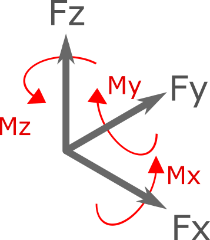
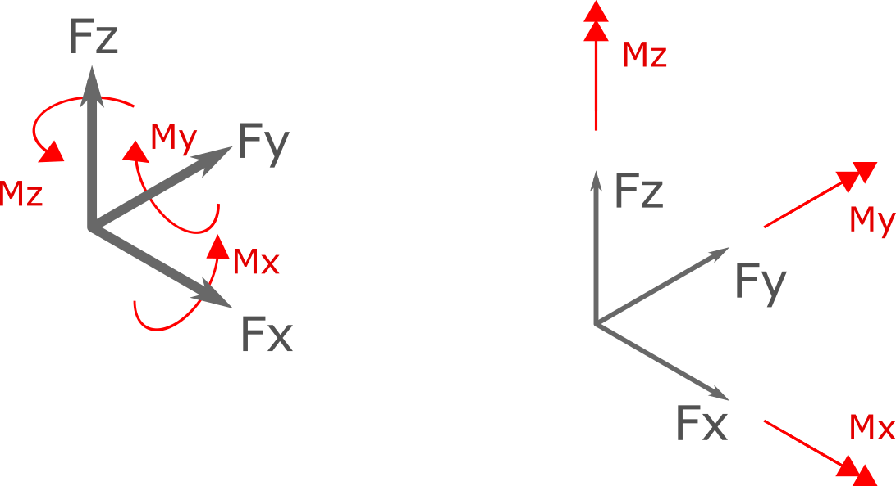

.. _cauchy-tensor:

CauchyStressTensor
==================
``CauchyStressTensor`` object represents a general stress tensor in 3D. 

   
   
Examples
---

    var force1 = new Force();
	force1.Fx = 10;//x component of force equal to 10 [N]
	force1.Mz = 15;//z component of moment equal to 15 [N.m]
	
	
	var force2 = new Force(10,0,0,15,0,0);//using constructor, parameters are fx,fy,fz,mx,my,mz
	//force2 is equal to force1