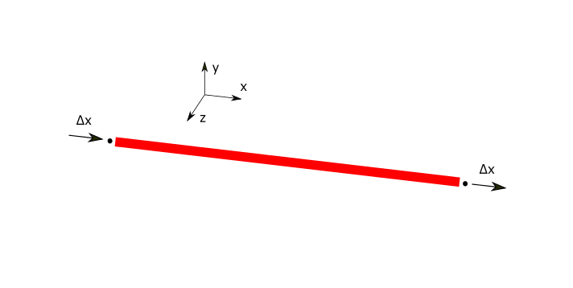
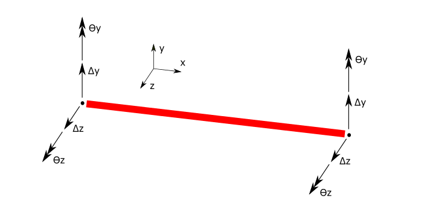

.. _BarElement-Behaviour:

Behaviours
----------
``BarElement.Behaviour`` property is an enum flag (enum flag  means an enum that can have several values at same time). It can be set to frame, beam, truss, shaft etc. 
The possible behaviours for the BarElement is:

- ``BarElementBehaviour.EulerBernoulyBeamY`` : Beam in Y direction based on Euler-Bernouly theory. DoFs are shown in below image:

DoFs of ``BarElementBehaviour.EulerBernoulyBeamY``

- ``BarElementBehaviour.EulerBernoulyBeamZ`` : Beam in Z direction based on Euler-Bernouly theory. DoFs are shown in below image:

DoFs of ``BarElementBehaviour.EulerBernoulyBeamZ``

- ``BarElementBehaviour.TimoshenkoBeamY`` : Beam in Y direction based on Timoshenko's theory (shear deformation). DoFs are shown in below image:

DoFs of ``BarElementBehaviour.TimoshenkoBeamY``

- ``BarElementBehaviour.TimoshenkoBeamZ`` : Beam in Z direction based on Timoshenko's theory (shear deformation). DoFs are shown in below image:

DoFs of ``BarElementBehaviour.TimoshenkoBeamZ``

- ``BarElementBehaviour.Truss`` : Only axial load carrying. DoFs are shown in below image:

DoFs of ``BarElementBehaviour.Truss``

- ``BarElementBehaviour.Shaft`` : Only torsional moment carrying. DoFs are shown in below image:

.. figure:: ../images/bar-shaft.png
   :align: center

DoFs of ``BarElementBehaviour.Shaft``

These behaviours can be combined , for example a truss member should only have a Truss behaviour, but a 3d frame member does have two beam behaviour in Y and Z directions, a truss behaviour and a shaft behaviour, (all these behaviours at the same time).
 
This is an example which makes a BarElement with truss behaviour which in real acts as a truss member that only can carry axial load:

.. code-block:: cs
   
   var bar = new BarElement();
   bar.Behaviour = BarElementBehaviour.Truss;

There is another utility static class named ``BarElementBehaviours`` which contains predefined combination behaviours for BarElement which is more user (developer) friendly than original enum flag.
This is example usage of ``BarElementBehaviours`` class:

.. code-block:: cs
   
   var bar = new BarElement();
   bar.Behaviour = BarElementBehaviours.FullFrame;

Which is exactly equal to:

.. code-block:: cs
   
   var bar = new BarElement();
   bar.Behaviour = BarElementBehaviour.Truss | BarElementBehaviour.BeamYEulerBernoulli | BarElementBehaviour.BeamZEulerBernoulli | BarElementBehaviour.Shaft;

So better to use ``BarElementBehaviours`` unless needed manually define combination of behaviours.

- ``BarElementBehaviours.FullBeam`` and ``BarElementBehaviours.FullBeamWithShearDefomation``: 

DoFs of ``BarElementBehaviours.FullBeam`` and ``BarElementBehaviours.FullBeamWithShearDefomation``

- ``BarElementBehaviours.FullFrame`` and ``BarElementBehaviours.FullFrameWithShearDeformation``: 

.. image:: ../images/bar-fullframe.png
   :align: center

DoFs of ``BarElementBehaviours.FullFrame`` and ``BarElementBehaviours.FullFrameWithShearDeformation``

