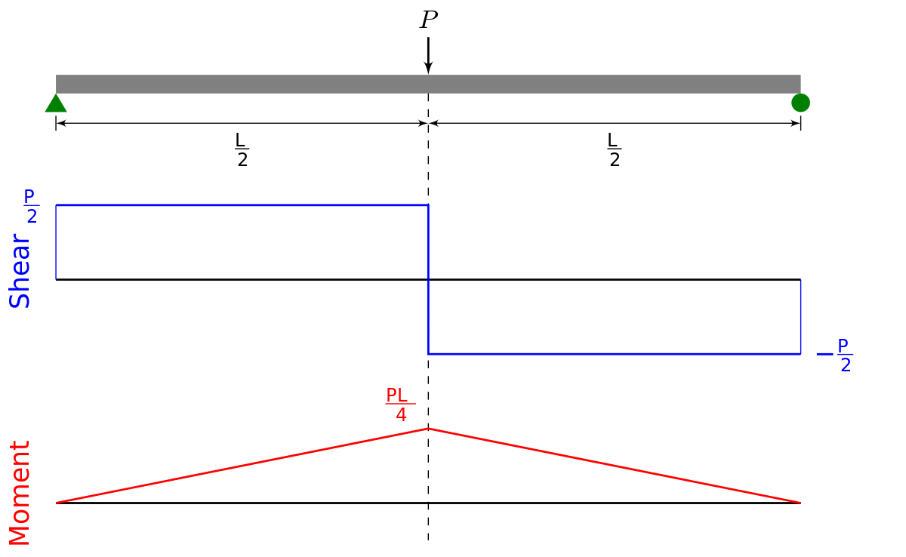

.. _BarElement-InternalForce-example:
Bar Internal Force
##################

In this example we are going to analyse and get internal force of this element

Lets assume:

- P = 10 KN
- L = 2 M
- Section of element is a solid 10x10cm
- Material is steel with E = 210e9 Pa and poisson ratio of 0.3

here is the code

.. code-block:: cs

    // Initiating Model, Nodes and Members
    var model = new Model();
	
	var n1 = new Node(0, 0, 0);
	n1.Label = "n1";//Set a unique label for node
	var n2 = new Node(2, 0, 0) {Label = "n2"};//using object initializer for assigning Label
	
	var e0 = new BarElement(n1, n2) { Label = "e1", Behavior = BarElementBehaviours.FullFrame };
	
	model.Nodes.Add(n1, n2);
	model.Elements.Add(e1);
	
	e1.Section = new Sections.UniformParametric1DSection() { A = 9e-4 };//TODO: Edit

	e1.Material = Materials.UniformIsotropicMaterial.CreateFromYoungPoisson(210e9, 0.3);
	
	n1.Constraints = Constraints.Fixed;
	
	var load = new ConcentratedLoad(10kn etc) !
	
	e1.Loads.Add(load);
	
	model.Solve_Mpc();
	

as you can see from image, the internal force at middle of element is a little challenging. The shear force a little before center is +P/2 but a little after center will be -P/2, we call this point as a Discretation point for internal force. Theoriticall the internal force is not defined at exactly this point, thus if we call `e1.GetExactInternalForceAt(0.0)` (0.0 is iso parametric coordination of middle of beam), then we get a `InvalidInternalForceLocationException`. Same will happen when `e1.GetExactInternalForceAt(-1.0)` or `e1.GetExactInternalForceAt(+1.0)` is called. Actually the discretation points are depended on internal loads (body loads) applied on element.  user can find list of discretation points on BarElements whith `BarElement.GetInternalForceDiscretationPoints()` and simply bypass those. user could split points at these points, in this example we have a discretation point at ξ=0.0, thus we could get internal force a little before and a little after this point like ξ=-1e-9 and ξ=1e-9 but not exactly at the point ξ=0.0