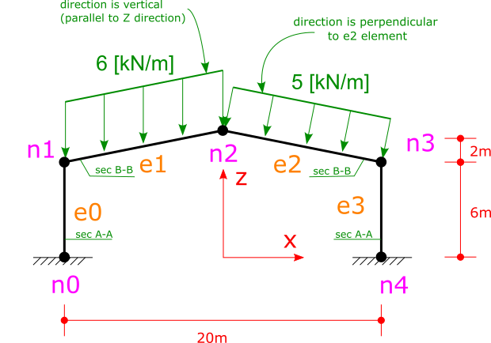

.. _BarElement-InclienedFrame-example:

Inclined Frame Example
######################

Consider the inclined frame shown in fig below.

   
There are two loads on top elements. One has a 6 kn/m magitude and its direction is vertical, another one has 5kn/m magnitude and it is perpendicular to the `e2` element.

**step 1:** create model, nodes and elements:

.. code-block:: cs

	var model = new Model();

	model.Nodes.Add(new Node(-10, 0, 0) { Label = "n0" });
	model.Nodes.Add(new Node(-10, 0, 6) { Label = "n1" });
	model.Nodes.Add(new Node(0, 0, 8) { Label = "n2" });
	model.Nodes.Add(new Node(10, 0, 6) { Label = "n3" });
	model.Nodes.Add(new Node(10, 0, 0) { Label = "n4" });

	model.Elements.Add(new BarElement(model.Nodes["n0"], model.Nodes["n1"]) { Label = "e0"});
	model.Elements.Add(new BarElement(model.Nodes["n1"], model.Nodes["n2"]) { Label = "e1"});
	model.Elements.Add(new BarElement(model.Nodes["n2"], model.Nodes["n3"]) { Label = "e2" });
	model.Elements.Add(new BarElement(model.Nodes["n3"], model.Nodes["n4"]) { Label = "e3" });

**step 2:** define support nodes (nodal constraints)

.. code-block:: cs

	model.Nodes["n0"].Constraints = model.Nodes["n4"].Constraints = Constraints.Fixed;

**step 3:** assign material and section to the elements

.. code-block:: cs

	var secAA = new Sections.UniformGeometric1DSection(SectionGenerator.GetISetion(0.24, 0.67, 0.01, 0.006));
	var secBB = new Sections.UniformGeometric1DSection(SectionGenerator.GetISetion(0.24, 0.52, 0.01, 0.006));
	var mat = Materials.UniformIsotropicMaterial.CreateFromYoungPoisson(210e9, 0.3);

	(model.Elements["e0"] as BarElement).Material = mat;
	(model.Elements["e1"] as BarElement).Material = mat;
	(model.Elements["e2"] as BarElement).Material = mat;
	(model.Elements["e3"] as BarElement).Material = mat;

	(model.Elements["e0"] as BarElement).Section = secAA;
	(model.Elements["e1"] as BarElement).Section = secBB;
	(model.Elements["e2"] as BarElement).Section = secBB;
	(model.Elements["e3"] as BarElement).Section = secAA;
	
**step 4:** assign loads to elements

.. code-block:: cs

	var u1 = new Loads.UniformLoad(LoadCase.DefaultLoadCase, new Vector(0,0,1), -6000, CoordinationSystem.Global);
	var u2 = new Loads.UniformLoad(LoadCase.DefaultLoadCase, new Vector(0,0,1), -5000, CoordinationSystem.Local);

	model.Elements["e1"].Loads.Add(u1);
	model.Elements["e2"].Loads.Add(u2);

**step 5:** analyse the model

.. code-block:: cs

	model.Solve_MPC();

**step 6:** get analysis results

Usually aim of analysis is to find some quantities like internal force and nodal displacements.
After solving the model we can find nodal displacements with `Node.GetNodalDisplacement`, and ``BarElement``'s internal force with ``BarELement.GetInternalForceAt`` and ``BarElement.GetExactInternalForceAt`` methods. There is a difference between the two methods. Details are available in :ref:`BarElement-InternalForce` section in documentation of `BarElement`.

for example the support reaction of node `N3` can be found and printed to application Console like this:

.. code-block:: cs

	var n3Force = model.Nodes["N3"].GetSupportReaction();
	Console.WriteLine("Support reaction of n4: {0}", n3Force);
    
This is the result of print on console:

Support reaction of n4: F: -37514.9891729259, 0, 51261.532772234, M: 0, -97714.6039503916, 0

Element's internal force can be found like this:
For example need to find internal force of element in a point with distance of 1m (one meter) of start node.
We can use `BarElement.GetInternalForceAt()` method to simply get the internal force of element at desired location of length of element, but there is an important thing here:
and that is the input of `BarElement.GetInternalForceAt()` method is not in meter dimension not any other standard units of measuring length. The input is in another coordination system named iso-parametric crs. The isoparametric crs is widely used in FEM. More details about  BarElement does have a method for converting 

.. code-block:: cs

	var x = 1.0;//need to find internal force at x = 1.0 m
	var iso = (model.Elements["e3"] as BarElement).LocalCoordsToIsoCoords(x);
	var e4Force = (model.Elements["e3"] as BarElement).GetInternalForceAt(iso[0]);
	Console.WriteLine("internal force at x={0} is {1}", x, e4Force);

whole source code exists in the `BarIncliendFrameExample.cs` file.