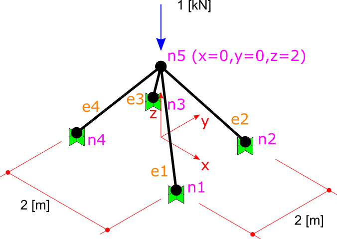

Small 3D Truss Example
#########################

In this example, I want to analyse a simple truss with 4 members as shown in figure.

All members sections are the same, a square steel section with dimension of 3 cm. So the properties of members will be:

The area of SECTION:

  ``A = 0.03m * 0.03m = 9 * 10^-4 m^2``

The `Elastic or Young Modulus <https://en.wikipedia.org/wiki/Young%27s_modulus>`_ of MATERIAL:

   ``E = 210 GPa = 210*10^9 Pa = 210*10^9 N/M^2``

The `Poison Ratio <https://en.wikipedia.org/wiki/Poisson%27s_ratio>`_ of MATERIAL:

   ``? = 0.3``

Please note that for truss memeber usually Poison ratio is not taken into account anywhere in calculation, so settings it to any value in ``(0,0.5)`` range will not change any part of the result, but setting to zero maybe cause some problem! so better to assume a usual value of 0.3 for it.

We should do these steps before we solve the model:

- Step1: Create Model, Members and Nodes.

- Step2: Add the Nodes and Elements to Model.

- Step3: Assign geometrical and mechanical properties to Elements.

- Step4: Assign Constraints to Nodes (fix the DoF s).

- Step5: Assign Load to Node.

And finally solve model with Model.Solve() method and then extract analysis results like support reactions or member internal forces or nodal deflections.

Step1: Create Model, Members and Nodes
***************************************

We should create a Finite Element model first and then add members and nodes to it:

.. code-block:: cs

    // Initiating Model, Nodes and Members
    var model = new Model();
	
Creating Nodes
==============

We should create nodes like this. In BriefFiniteElement.NET, every node and element have a property of type string named Label and another one named Tag both of which are inherited from BriefFiniteElementNet.StructurePart. In every Model, Label of every member should be unique among all members (both Nodes and Elements) unless the Label be equal to null which is by default. In the below code, we are creating 5 nodes of truss and assigning a unique Label to each one.

.. code-block:: cs

	var n1 = new Node(1, 1, 0);
	n1.Label = "n1";//Set a unique label for node
	var n2 = new Node(-1, 1, 0) {Label = "n2"};//using object initializer for assigning Label
	var n3 = new Node(1, -1, 0) {Label = "n3"};
	var n4 = new Node(-1, -1, 0) {Label = "n4"};
	var n5 = new Node(0, 0, 1) {Label = "n5"};
	

Creating Elements
=================

Next we have to create the elements. In BriefFiniteElement.NET, the TrussElement and BarElement classes do represents a truss element in 3D. As TrussElement is old and obsolete, we use BarElement:

.. code-block:: cs

	var e1 = new BarElement(n1, n5) { Label = "e1", Behavior = BarElementBehaviours.Truss };
	var e2 = new BarElement(n2, n5) {Label = "e2", Behavior = BarElementBehaviours.Truss };
	var e3 = new BarElement(n3, n5) {Label = "e3", Behavior = BarElementBehaviours.Truss };
	var e4 = new BarElement(n4, n5) { Label = "e4", Behavior = BarElementBehaviours.Truss };

note that BarElement can be used as a frame too, so you should set the BarElement.Behavior to BarElementBehaviours.Truss in order to make it a truss member, else you will have a frame member instead of truss!

Step2: Add the Nodes and Elements to Model.
********************************************

You can simply add the elements and nodes we created into the Model. Model has two members ``Model.Elements`` and ``Model.Nodes`` which both represents an ``IList<T>`` of nodes and members, plus an ``Add()`` method that accept several items:

.. code-block:: cs

	model.Nodes.Add(n1, n2, n3, n4, n5);
	model.Elements.Add(e1, e2, e3, e4);

Please note that if Node or Element’s Label property is something else than null, then it should be unique among all nodes and elements, else you will receive an error when adding member with duplicated label into model.

Step3: Assign geometrical and mechanical properties to Elements
*****************************************************************

As elastic module for all members equals to 210 GPa and area of all members equals to 0.0009 m^2 we can set the element properties like this:

.. code-block:: cs

	e1.Section = new Sections.UniformParametric1DSection() { A = 9e-4 };
	e2.Section = new Sections.UniformParametric1DSection() { A = 9e-4 };
	e3.Section = new Sections.UniformParametric1DSection() { A = 9e-4 };
	e4.Section = new Sections.UniformParametric1DSection() { A = 9e-4 };

	e1.Material = Materials.UniformIsotropicMaterial.CreateFromYoungPoisson(210e9, 0.3);
	e2.Material = Materials.UniformIsotropicMaterial.CreateFromYoungPoisson(210e9, 0.3);
	e3.Material = Materials.UniformIsotropicMaterial.CreateFromYoungPoisson(210e9, 0.3);
	e4.Material = Materials.UniformIsotropicMaterial.CreateFromYoungPoisson(210e9, 0.3);

Step4: Assign Constraints to Nodes (fix the DoF s)
**************************************************

Now, we should make some DoFs of structure fix in order to make analysis logically possible.

In BriefFiniteElement.NET, every node has 6 degree of freedom: ``X``, ``Y``, and ``Z`` rotations and ``X``, ``Y``, and ``Z`` translations. For a every truss model, we have to fix rotational DoFs for each Node (X,Y and Z rotation). Also the nodes 1 to 4 are also movement fixed, then nodes 1 to 4 should be totally fixed and node 5 should be rotation fixed. In BriefFiniteElement.NET, a struct named Constraint represents a constraint that is applicable to a 6 DoF node, it have Dx, Dy, Dz, Rx, Ry and Rz properties of type DofConstraint which is an enum and have two possible values 0 (Released) and 1 (Fixed). For making work easier, the Constraint struct has some predefined Constraints in its static properties for example Constraint.Fixed or Constraint.Free. Here is more detailed information:

.. csv-table::
   :header: "Property Name", "Description"
   :widths: 15, 15

   "Constraints.Fixed", "All 6 DoFs are fixed"
   "Constraints.Released", "All 6 DoFs are released"
   "Constraints.MovementFixed", "3 translation DoFs are fixed and 3 rotation DoFs are released"
   "Constraints.RotationFixed", "3 translation DoFs are released and 3 rotation DoFs are fixed"

We can fix DoFs of nodes 1 to 4 like this:

.. code-block:: cs

  n1.Constraints = n2.Constraints = n3.Constraints = n4.Constraints = new Constraint(dx:DofConstraint.Fixed, dy:DofConstraint.Fixed, dz:DofConstraint.Fixed, rx:DofConstraint.Fixed, ry:DofConstraint.Fixed, rz:DofConstraint.Fixed);

or:

.. code-block:: cs

  n1.Constraints = n2.Constraints = n3.Constraints = n4.Constraints = Constraints.Fixed

and should fix the rotational DoFs of node 5:

.. code-block:: cs
  n5.Constraints = Constraints.RotationFixed
  
Step5: Assign Load to Node
***************************

In BriefFiniteElement.NET, there is a struct named Force which represent a concentrated force in 3D space which contains of 3 force components in X, Y and Z directions and three moment components in X, Y and Z directions. It have 6 double properties named Fx, Fy, Fz, Mx, My and Mz that are representing the load components. There are also two properties of type Vector for this struct named Forces and Moments. On setting or getting, they will use the Fx, Fy, Fz, Mx, My and Mz to perform operations:

.. code-block:: cs

	/// 

	/// Gets or sets the forces.
	/// 

	/// <value>
	/// The forces as a <see cref="Vector"/>.
	/// </value>
	public Vector Forces
	{
		get
		{
			return new Vector(fx,fy,fz);
		}

		set
		{
			this.fx = value.X;
			this.fy = value.Y;
			this.fz = value.Z;
		}
	}

Same is with Moments property. The Forces and Moments property do not actually store values in something other than 6 obvious properties.

As LoadCase and LoadCombination concepts are supported in BriefFiniteElement.NET, every Load should have a LoadCase. A LoadCase is simply a struct that has two properties: CaseName with string type and LoadType with LoadType type which is an enum and has some possible values:

.. code-block:: cs

	public enum LoadType
	{
		  Default = 0,
		  Dead,
		  Live,
		  Snow,
		  Wind,
		  Quake,
		  Crane,
		  Other
	}

The LoadType.Default is a load type that is created for built in usage in library and it do not meant to have meaning like Dead, Live, etc. The LoadCase struct has a static property named LoadCase.DefaultLoadCase:

.. code-block:: cs

	/// 

	/// Gets the default load case.
	/// 

	/// <value>
	/// The default load case.
	/// </value>
	/// <remarks>
	/// Gets a LoadCase with <see cref="LoadType"/> of <see cref="BriefFiniteElementNet.LoadType.Default"/> and empty <see cref="CaseName"/></remarks>
	public static LoadCase DefaultLoadCase
	{
		  get { return new LoadCase(); }
	} 

Which represents a LoadCase with LoadType of Default and CaseName of null. We will call such a LoadCase as DefaultLoadCase. For simplicity of usage in BriefFiniteElement.NET everywhere that you’ll prompt for a LoadCase, if you do not provide a LoadCase then the LoadCase is assumed DefualtLoadCase by the library. For example, when you want to assign a load to a node, you should provide a LoadCase for it, like this:

.. code-block:: cs

  var load = new NodalLoad(new Force(0, 0, -1000, 0, 0, 0), new LoadCase("Case1",LoadType.Dead));

but if you do not provide the LoadCase in the above code like this:

.. code-block:: cs

  var load = new NodalLoad(new Force(0, 0, -1000, 0, 0, 0));

then the load case will be assumed DefaultLoadCase by the library.

Ok, next we have to add 1KN load to node 5 like this, will do it with DefaultLoadCase:

.. code-block:: cs

  var force = new Force(0, 0, -1000, 0, 0, 0);
  n5.Loads.Add(new NodalLoad(force));//adds a load with LoadCase of DefaultLoadCase to node loads

And finally solve the model with model.Solve() method. Actually solving the model is done in two stages:

- First stage is creating stiffness matrix and factorizing stiffness matrix which will take majority of time for analysing

- Second phase is analysing structure against each load case which takes much less time against first stage (say for example 13 sec for first stage and 0.5 sec for second stage).

First stage is done in model.Solve() method and second stage will done if they’ll be need to.

There are loads with different LoadCases that are applied to the Nodes and Elements. So the Node.GetSupportReaction() method have an overload which gets a LoadCombination and returns the support reactions based on the load combination. LoadCombination has a static property named LoadCombination.DefaultLoadCombination which has only one LoadCase in it (the DefaultLoadCase) with factor of 1.0. also everywhere that you should provide a LoadCombination, if you do not provide any, then DefaultLoadCombination will be considered by library. I’ve used DefaultLoadCase and DefaultLoadCombination in library to make working with library easier for people who are not familiar with load case and load combination stuff.

For getting the support reaction for the truss, we can simply call Node.GetSupportReaction() to get support reaction for every node:

.. code-block:: cs

	Force r1 = n1.GetSupportReaction();
	Force r2 = n2.GetSupportReaction();
	Force r3 = n3.GetSupportReaction();
	Force r4 = n4.GetSupportReaction();

The plus operator is overloaded for Force struct, so we can check the sum of support reactions:

.. code-block:: cs

	Force rt = r1 + r2 + r3 + r4;//shows the Fz=1000 and Fx=Fy=Mx=My=Mz=0.0

The forces (Fx, Fy and Fz) amount should be equal to sum of external loads and direction should be opposite to external loads to satisfy the structure static equilibrium equations.

All Codes Together
******************

This is all codes above for truss example.

Please note that these codes are available in ``BriefFiniteElementNet.CodeProjectExamples`` project in library solution.
NOTE: below code is outdated, TODO update
 
.. code-block:: cs

	private static void Example1()
	{
		Console.WriteLine("Example 1: Simple 3D truss with four members");

		// Initiating Model, Nodes and Members
		var model = new Model();

		var n1 = new Node(1, 1, 0);
		n1.Label = "n1";//Set a unique label for node
		var n2 = new Node(-1, 1, 0) {Label = "n2"};//using object initializer for assigning Label
		var n3 = new Node(1, -1, 0) {Label = "n3"};
		var n4 = new Node(-1, -1, 0) {Label = "n4"};
		var n5 = new Node(0, 0, 1) {Label = "n5"};

		var e1 = new TrussElement2Node(n1, n5) {Label = "e1"};
		var e2 = new TrussElement2Node(n2, n5) {Label = "e2"};
		var e3 = new TrussElement2Node(n3, n5) {Label = "e3"};
		var e4 = new TrussElement2Node(n4, n5) {Label = "e4"};
		//Note: labels for all members should be unique, else you will receive InvalidLabelException when adding it to model

		e1.A = e2.A = e3.A = e4.A = 9e-4;
		e1.E = e2.E = e3.E = e4.E = 210e9;

		model.Nodes.Add(n1, n2, n3, n4, n5);
		model.Elements.Add(e1, e2, e3, e4);

		//Applying restrains

		n1.Constraints = n2.Constraints = n3.Constraints = n4.Constraints = Constraint.Fixed;
		n5.Constraints = Constraint.RotationFixed;

		//Applying load
		var force = new Force(0, 1000, -1000, 0, 0, 0);
		n5.Loads.Add(new NodalLoad(force));//adds a load with LoadCase of DefaultLoadCase to node loads
		
		//Adds a NodalLoad with Default LoadCase

		model.Solve();

		var r1 = n1.GetSupportReaction();
		var r2 = n2.GetSupportReaction();
		var r3 = n3.GetSupportReaction();
		var r4 = n4.GetSupportReaction();

		var rt = r1 + r2 + r3 + r4;//shows the Fz=1000 and Fx=Fy=Mx=My=Mz=0.0

		Console.WriteLine("Total reactions SUM :" + rt.ToString());
	}

console result after executing:

.. topic:: Console Output

    Example 1: Simple 3D truss with four members 

    Total reactions SUM :F: 0, 0, 1000, M: 0, 0, 0
