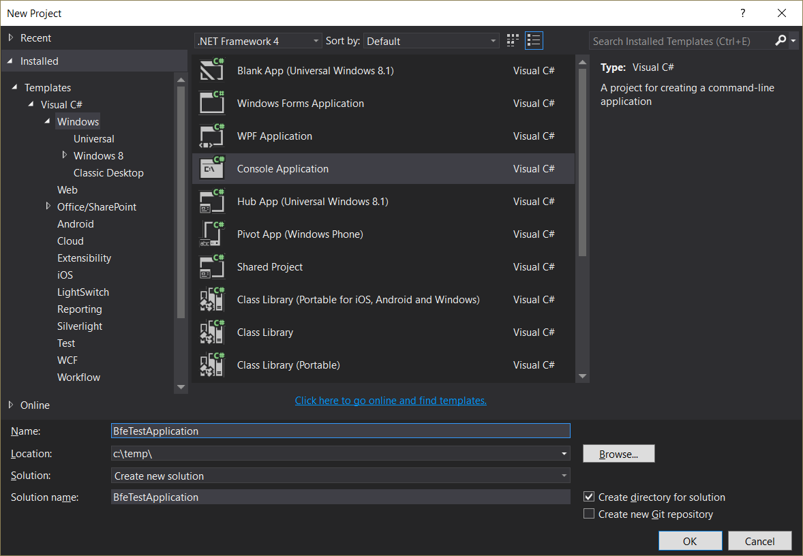
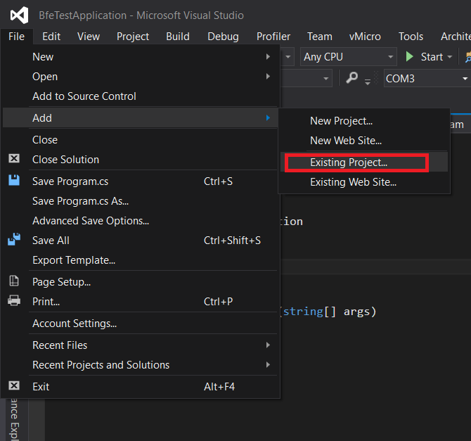
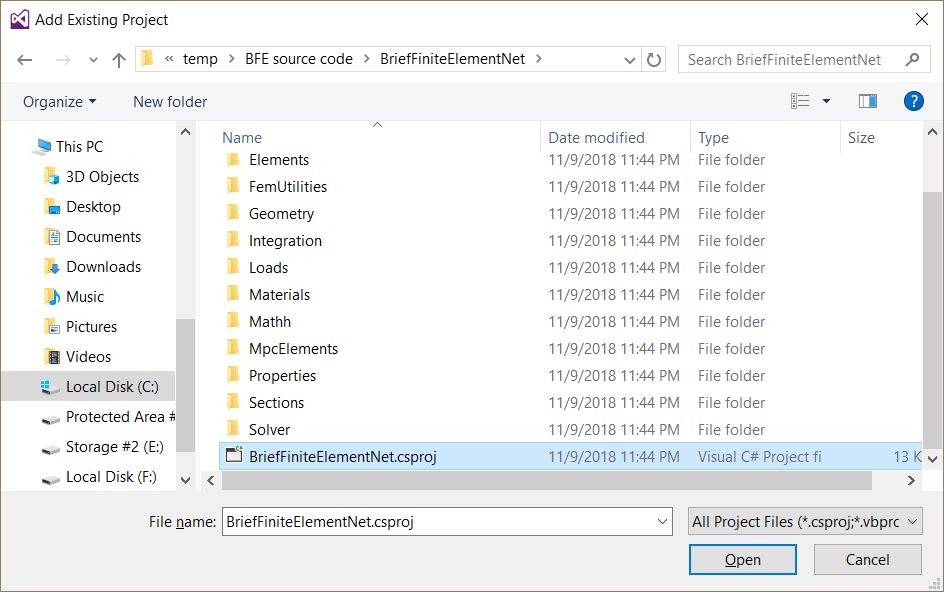

Create a project and compile BRiefFiniteElement from source code
================================================================

After downloading the source code you should reference the main projects of bfe in your C# project.
we will use Visual Studio 2015 in next. you can use any version of Visual Studio IDE including free express or community version. by the way it is downloadable from ``https://visualstudio.microsoft.com/``.
In next we will use visual Studio 2015...

Some users reported project does not build with Visual Studio 2017, there are some workarounds in (`issue #42 on project on github <https://github.com/BriefFiniteElementNet/BriefFiniteElement.Net/issues/42>`_).

Creating new project
--------------------

After installation, Create a new C# application with name ``BfeTestApplication`` and type ``Console Application`` (`Create New Solution in Visual Studio <https://docs.microsoft.com/en-us/visualstudio/ide/creating-solutions-and-projects?view=vs-2017>`_).

Add BFE codes (projects) into solution
--------------------------------------

You should add the actual BFE core codes into your solution. (`Adding existing project to Solution in Visual Studio <https://docs.microsoft.com/en-us/sql/ssms/solution/add-an-existing-project-to-a-solution?view=sql-server-2017>`_)

To add BFE code to your solution, do the following:

1- In Solution Explorer, select the solution. 

2- On the File menu, point to Add, and click Existing Project.

3- In the Add Existing Project dialog box, locate the project you want to add, select the project file, and then click Open.

you should add two projects to your solution:

1- BriefFiniteElementNet located at ``<root folder>\BriefFiniteElementNet\BriefFiniteElementNet.csproj``

2- BriefFiniteElementNet.Common located at ``<root folder>\BriefFiniteElementNet.Common\BriefFiniteElementNet.Common.csproj``

adding two projects,

   

   

   
after adding two projects, solution explorer tab in visual studio should looks like this:

Add reference of BFE projects into first project
------------------------------------------------

Now two C# projects ``BriefFiniteElementNet`` and ``BriefFiniteElementNet.Common`` are added to our solution. next we should add a reference of each one into first project named ``BfeTestApplication`` (`More Info <https://msdn.microsoft.com/en-us/library/wkze6zky.aspx>`_).

   

Start Coding with BFE
---------------------

Now things are ready to start coding. Open the ``Program.cs`` file in project ``BfeTestApplication`` inside Visual Studio, it should be something like this:

The ``static void Main(string[] args)`` method will execute once we start to execute the project. so we should add our code inside it:

.. code-block:: cs

  //a console beam, totally fixed in start n1, totally free in end n2
  // a load of 1000 N
  var model = new BriefFiniteElementNet.Model();

  Node n1, n2;

  model.Nodes.Add(n1 = new Node(x:0.0, y:0.0, z:0.0) { Constraints = Constraints.Fixed });
  model.Nodes.Add(n2 = new Node(x:1.0, y:0.0, z:0.0) { Constraints = Constraints.Released });

  var elm = new BarElement(n1, n2);

  model.Elements.Add(elm);

  elm.Section = new BriefFiniteElementNet.Sections.UniformParametric1DSection(a: 0.01, iy: 8.3e-6, iz: 8.3e-6, j: 16.6e-6);//section's second area moments Iy and Iz = 8.3*10^-6, area = 0.01
  elm.Material = BriefFiniteElementNet.Materials.UniformIsotropicMaterial.CreateFromYoungPoisson(210e9, 0.3);//Elastic mudule is 210e9 and poisson ratio is 0.3

  var load = new BriefFiniteElementNet.NodalLoad();
  var frc = new Force();
  frc.Fz = 1000;// 1kN force in Z direction
  load.Force = frc;

  n2.Loads.Add(load);

  model.Solve_MPC();//or model.Solve();

  var d2 = n2.GetNodalDisplacement();

  Console.WriteLine("Nodal displacement in Z direction is {0} meters (thus {1} mm)", d2.DZ, d2.DZ * 1000);//print the Dz of n2 into console
  Console.WriteLine("Nodal rotation in Y direction is {0} radians (thus {1} degrees)", d2.RY, d2.RY * 180.0 / Math.PI);//print the Rz of n2 into console

  Console.WriteLine("Press any key to continue");
  Console.ReadKey();

also add two ``using`` directives on top of file:

.. code-block:: cs

  using BriefFiniteElementNet;
  using BriefFiniteElementNet.Elements;

finally it should look like:

   
Then we start debug by pressign F5 key or "Debug" menu, then "Start Debugging". console window should show up like this:

