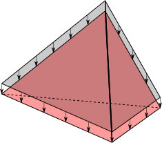

.. _UniformLoad:

UniformLoad
============
``UniformLoad`` in namespace ``BriefFiniteElementNet.Loads``, is a constant distributed load which can apply on 1D (like ``BarElement``), 2D (like ``TriangleElement``) or 3D (like ``TetrahedronElement``) elements. Self weight loads are good examples that can be modeled with this type of load.

Here are examples illustrated in image (note that many of these loads are not available in this library!)

   
   ``UnformLoad`` applying on a BarElement's body

   
   ``UnformLoad`` applying on a ``TriangleElement``'s body
   

   
   ``UnformLoad`` applying on a ``TetrahedronElement``'s body

   
   ``UnformLoad`` applying on one of a ``TriangleElement``'s edges

   
   ``UnformLoad`` applying on one of a ``TetrahedronElement``'s faces

   
   ``UnformLoad`` applying on one of a ``TetrahedronElement``'s edges

Magnitude
---------
``UniformLoad.Magnitude`` which is a ``double`` property of ``UniformLoad``, defines the Magnitude of uniform load. Based on ``UniformLoad`` is applied on what element, the dimension is different:

	- If it is applied on a 1D element like ``BarElement``, then the dimension is [N/m]
	- If it is applied on a 2D element like ``TriangleElement``, then the dimension is [N/m^2]
	- If it is applied on a 3D element like ``TetrahedronElement``, then the dimension is [N/m^3]

.. _UniformLoad-coordination-system:

Coordination System
-------------------
``UniformLoad.CoordinationSystem`` which is a enum typed property of ``UniformLoad``, defines the coordination system of uniform load. It can only have two different values of ``CoordinationSystem.Global`` or ``CoordinationSystem.Local``:

	- ``CoordinationSystem.Global``: The load is assumed in global coordination system
	- ``CoordinationSystem.Local``: The load is assumed in local coordination system of element that load is applied to (each element type have different local coordination system which is stated in appropriated section).

Look at :ref:`element-load-coordination-system` for more information on how to use.

LoadDirection (Obsolete: see Direction)
-------------
``UniformLoad.LoadDirection`` which is a enum typed property of ``UniformLoad``, defines the direction of uniform load. It can only have three different values of ``LoadDirection.X`` or ``LoadDirection.Y`` or ``LoadDirection.Z``.

Look at examples section for more information on how to use.

TODO: obsolete the enum LoadDirection and use a vector for more enhanced usage.

Direction
-------------
``UniformLoad.Direction`` which is a property of ``UniformLoad`` with type of ``Vector``, defines the direction of uniform load. An instance of ``Vector`` class defines a vector in 3d space with three components of ``X``, ``Y`` and ``Z``. Note that length of vector is not takken into account, only its direction is used.

Look at examples section and definition of local CoordinationSystem in BarElement, TriangleElement, etc. for more information on how to use.

