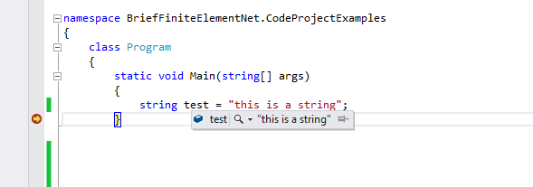
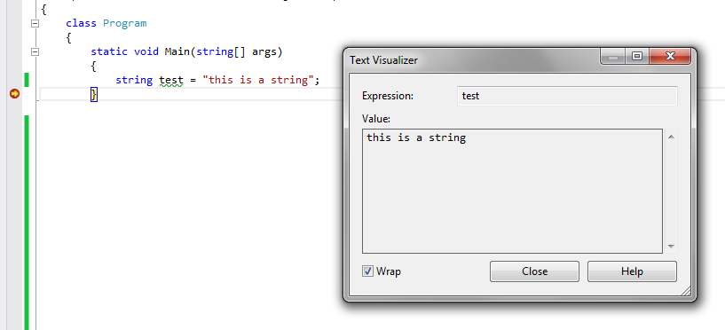
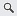
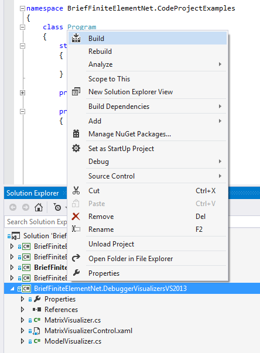
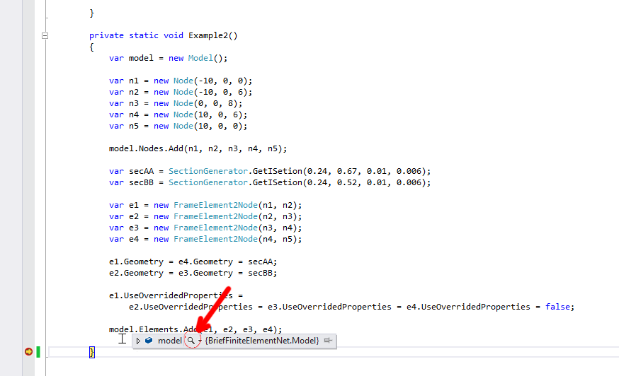
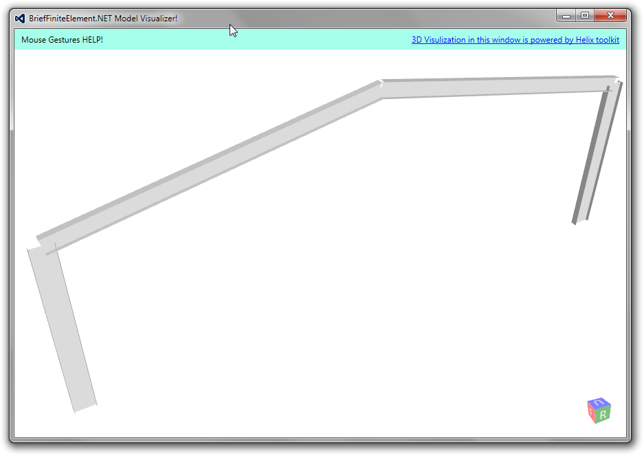

Install Debugger Visualizers
============================

What is debugger visualizer
---------------------------

In visual studio when you are debugging an application, you can view the live values of variables like image below:

   
In image you can see there is a magnifier icon (debug2.png) next to test variable, this shows that there is a debugger visualizer for string type and you can click on the icon to see the details:

   
BriefFiniteElement.NET library also contains debugger visualizer for visualizing the BriefFiniteElementNet.Model instances but you have to install the visualizer first and then when in debug mode you move the cursor on any variable of type Model, then the magnifier icon will appear and you can click on that to see your model.

Usually installing a debugger visualizer in Visual Studio is as easy as copying a bunch of dll files in this address of your hard drive:
C:\Users\{YOUR_USER_NAME}\Documents\Visual Studio 20XX\Visualizers
where {YOUR_USER_NAME} is pointing to current user profile address and '20XX' is related to installed visual studio (2013 or 2012 or 2010 or ...). 
- note: if Visualizers folder not exists, it should be created.

	
Installing debugger visualizers inside Visual Studio
------------------------------------------------------------------------------

You should first Download latest source code of project. There are several solution files, for example `BriefFiniteElementNet.VS2019.sln` corresponds to Visual Studio 2019. There is several solution files in the package. Based on version of your Visual Studio you should open one of these solution files:

    BriefFiniteElementNet.VS2010.sln (for Visual Studio 2010)
    BriefFiniteElementNet.VS2012.sln (for Visual Studio 2012)
    BriefFiniteElementNet.VS2013.sln (for Visual Studio 2013)
	BriefFiniteElementNet.VS2015.sln (for Visual Studio 2015)
	BriefFiniteElementNet.VS2019.sln (for Visual Studio 2019)

After opening the solution file, there is a project named 'BriefFiniteElementNet.DebuggerVisualizersVS20XX' where `VS20XX` matches the Visual Studio version number running on local computer, simply right click on it and click Build to build it like this image:

after successful build of project it does automatically copy appropriated files into the "C:\Users\{YOUR_USER_NAME}\Documents\Visual Studio 20XX\Visualizers" using Post-Build events of project, and there is no need to do anything manually. The files that will copied to that address with build are:

- BriefFiniteElementNet.DebuggerVisualizers.dll
- BriefFiniteElementNet.dll
- BriefFiniteElementNet.Controls.dll
- BriefFiniteElementNet.Common.dll
- HelixToolkit.Wpf.dll
- DynamicDataDisplay.dll
	
Next time you debug your code, when move mouse to a variable with Model type you will see a magnifier icon like this:

   
and you should simply click it to visualize and see your model like this:

