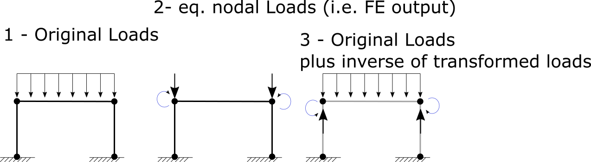
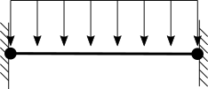

Exact Internal Force / Displacement for elements
================================================

For doing FEA, se should do:

- Form stiffness matrix in form of a square matrix (n*n)
- Form Nodal Loads vector in form of vector (n*1)
- Form Nodal displacement vector in form of vector (n*1)

This process do need the nodal loads which means we have to transform the elemental loads into nodal loads (which we call equaivalend nodal loads). Before we solve the model, the nodal loads vector and nodal displacement vector are partially known. it means we do not know the nodal loads at fixed DoFs (which are supports, i.e. support loads are unknown) but nodal loads at free DoFs are known which are our external loads. Also nodal displacements at fixed DoFs are known (i.e. Support settlement which is usually zero) but nodal displacement at free DoFs are unknown (i.e. the displacement of a node at tip of a consile beam under uniform loads is unknown which we are pusuing to find it with FEM).

So we need to transform elemental loads into equaivalent nodal loads, in order to use it in FE process. The equivalent nodal loads are depended on types of elemntal loads. after solving the equations and substitude displacement, w'll find the full nodal displacement vector and nodal force vector. After all these, we will use fundamental formulas like 
D=B*U (where D is displacement, B is that matrix which relates to shape function, and U is nodal load vector) for element. 

For example think of a single rod element hanging from top and it is under it's own weight.
We could consider the weight loads as uniform load in FE.

After solving the model w'll find out that the truss element is compressed by 1mm and initial length is 1m. area is shape of square of 1cm*1cm and steel material which E=210[GPa] here is how we calculate the intenral force of such element:

```
ε = 1[mm]/1[m] = 1[mm] / 1000[mm] = 0.001 = 1e-3
σ = E*ε = 210e9 *1e-3 = 210e6
F = A*σ = 0.01[m]*0.01[m]*210e6[Pa]=1e-4[m^2]*210e6=210e2 [Pa*m^2] = 21e3 [Pa*m^2] = 21 [KN]
```

The problem with converting the elemental loads into equaivalent nodal loads is the element will loose some information. In above example the element will not have constant internal force, but if we use equaivalent nodal loads, w'll get a constant internal force. i.e. the output of formula `F=D*B*U` where F is internal force, D is material matrix, B is constituve matrix (that matrix which relates to shape function) and U is nodal displacement vector.
To take the elemental loads into account one time again, one can use superposition principle.




in the image:

1- Original loads: Model with it's original elemental loads
2- Transformed loads: The model with loads converted to the equivalent nodals loads
3- Original Loads plus inverse of transformed loads: technically this loading will result in zero nodal displacement. because the load is technically equal to it's eq. nodal loads. when we add the inverse of eq. nodal loads, then it will be exactly zero in result, thus is means there will not be any nodal displacement with the model #3. i.e. the nodal displacements will be exactly zero. This is good, and we can now investigate each element separated from whole the other elements. the two columns do not have internal force, thus they will be straight and no internal force and straint. but the horizontal beam will have internal displacement and force. let us consider the horizontal beam separately. since there are no nodal displacements in model #3, then the nodal disaplcements of beam are zero. we can consider it as a beam with two ends fixed. the internal force of such element due to distributed load is (somehow) simply calculated with dual integral method or any suitable method. 



so the internal force of any element in model #1 (the original model) due to superposition is equal to internal load of that element in model 2 plus internal load of that element in model 3. the internal force of model number 2 is equal to `F=D.B.U` and internal force of mdel 3 is calculated with double integral method etc.
in BriefFiniteElement, the internal there are two methods for getting the internal force of elements: `Element.GetInternalForce()` and `Element.GetExactInternalForce()`.

- `Element.GetInternalForce()` do calculate the `F=D.B.U`, i.e. the internal force of model #2. this is the value usually returned from FE libraries.
- `Element.GetExactInternalForce()` this is a better solution, which also takes the effect of internal forces into account. i.e. it will calculate the internal force of model #2 and #3 separately, then add them together and return to caller method.


Theorical stuff
===============

consider beam under arbitrary and partial distributed load which:
- start from :math:`x=x_s`\ 
- end to :math:`x=x_e`\ 
- severity of load is defined by :math:`w0(x)`\ 
- :math:`F_0`\  a force applied to element at start (the support reaction of fixed beam)
- :math:`M_0`\  a moment applied to element at start (the support reaction of fixed beam)
- :math:`\theta_0`\  rotation at start (the support settlement of fixed beam, usually is zero)
- :math:`\Delta_0`\  displacement at start (the support settlement of fixed beam, usually is zero)

one can define the load function as a single function with partial feature of it into account. so we can simply integrate it. let's define a unit step function:

:math:`U_x0(x)=\begin{cases} &0 \text{ if } x\leq x_0 \\  &1 \text{ if } x> x_0 \end{cases}`\ 

the integral of unit step would be:


so one can define the loading to beam as:

:math:`W(x) = U_{xs}(x)*(1-U_{xe}(x))*w_0(x)`

the moment applied to beam:

:math:`V(x) = V_0 + \int W(x).dx`

The integral of an arbitrary function multiplied with unit step function can be defined as requiresive relation:

:math:`\int U_{x_0}.f(x).dx = U_{x_0}*(F(x)-F(x_0))`

where:
- :math:`U_{x_0}` is step function (the step location is in x0)
- :math:`f(x)` is an arbitrary function of (could be anything)
- :math:`F(x)` is initial function of f(x) i.e::math:`F(x)=\int f(x).dx`

for some case like :math:`\int \int \int f(x) *H_{x_0}.dx` will have 2^3 = 8 terms (each integral splits result into two terms). it would be a little annoying hand error prone to do it manually so w'll make a class dedicated to calculating the integral of step function (heaviside function is likewise), the code for our class will be generated by python and sympy code.
code exists in file `\external\matlab\exact-internal-force-displacement.py` in repo.
