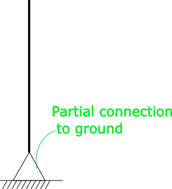
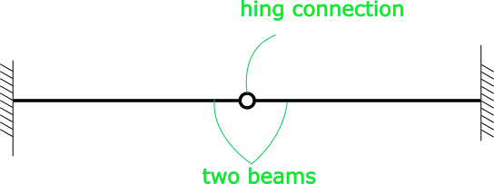
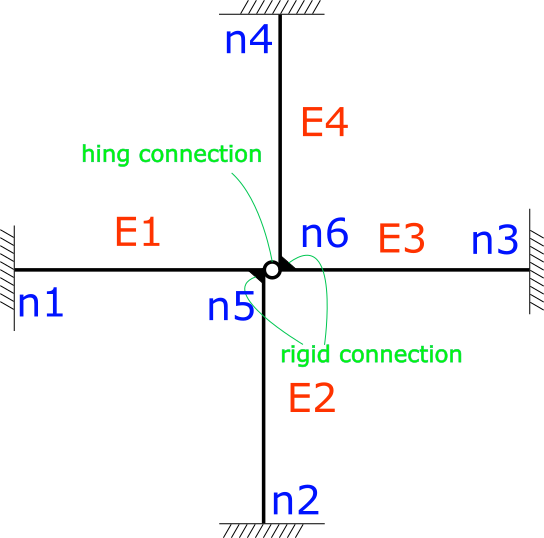

Handling Partial Connections and complicated connections
============================

In some models it is essential to have some partial connections. Like for example when a column (like image below) is partially fixed to ground. that is simple as settings `Constraint` of node into `Constraints.FixedDisplacement`.

For example another case, when a beam is partially connected to another beam from one end like image below. there is a hing at the center of beam or it can be said that two beams are connected with a hing.

or even a more complicated connection like this image. `E1` and `E2` connection is rigid, also `E2` and `E4` connection is rigid but there is also a partiall connection in between.

in this case as you see we have used node `n5` for connecting `E1` and `E2`. also another node `n6` for connecting `E3` and `E4`.  note that the location of `n5` and `n6` are identical. or if we want to talk with C# programming language, then `n5.Location == n6.Location`. altough the locations are same, but they are two different nodes and each one of these nodes have 6 DoF (3 displacement 3 rotation). so e1 and e2 are connected through n5, and their connection if rigid. same with e3 and e4. now we have to bind n5 and n6 partially, i.e. need to bind displacements of n5 and n6 together, but their rotation DoF is released and each one can rotate independently. for such partial connections, MPC elements should be used. for example `HingLink` or `TelepathyLink` could be used for this porpuse.